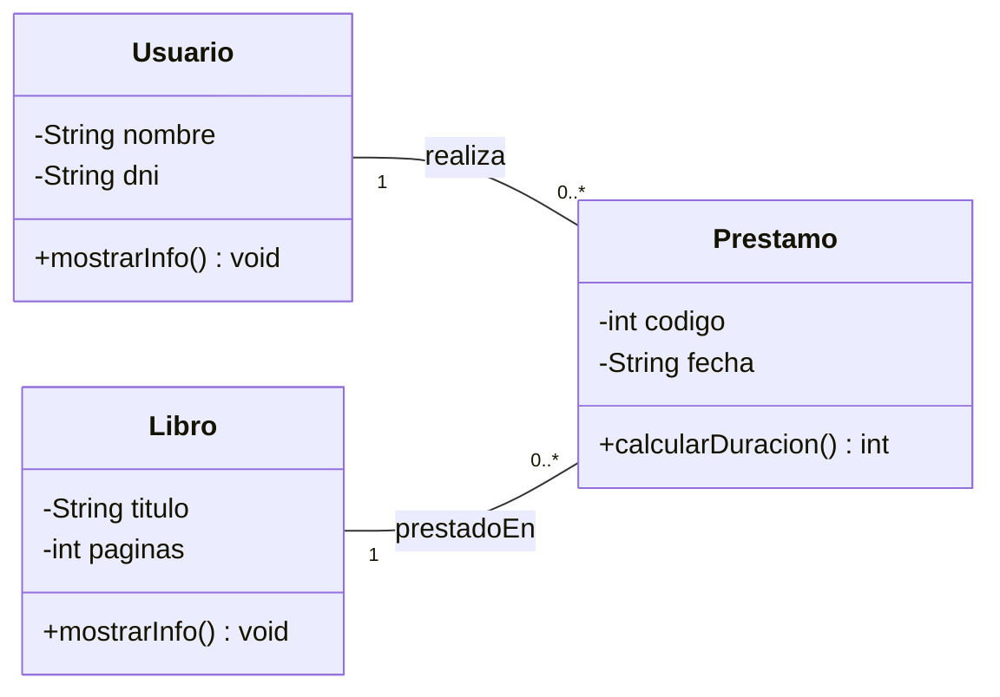

## Ejercicio 1: Biblioteca simple

* Un Libro tiene título y número de páginas.
* Un Usuario tiene nombre y DNI.
* Un Prestamo representa el préstamo de un libro a un usuario.

### Diagrama de clases (Mermaid)

### Implementa en **Java** las clases representadas en el diagrama:

1. Crear las clases `Libro`, `Usuario` y `Prestamo`.
2. Añadir:

   * atributos privados
   * constructores
   * getters y setters para los atributos privados
3. La clase `Prestamo` debe tener:

   * un `Usuario`
   * un `Libro`
4. Implementar en Prestamo el método `calcularDuración()` que devuelva como valor fijo `15`.

5. El proyecto debe implementar todo lo solicitado y compilar con `mvn compile`.

6. En la carpeta **docs** debes adjuntar capturas de pantalla de tus clases y el resultado de la compilación.

7. Añade las explicaciones que consideres en `docs/explicacion.md`.