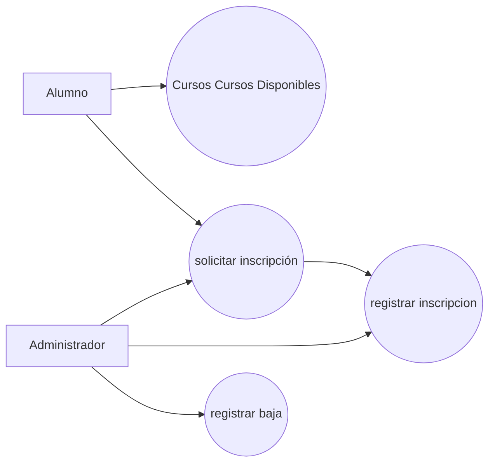

```mermaid
graph LR

%%Identificion de actores
Alumno[Alumno]
Administrador[Administrador]

%%Identificacion de casos de uso
casoConsultar((Cursos Cursos Disponibles))
casoSolicitar((solicitar inscripción))
casoRegistrarI((registrar inscripcion))
casoRegistrarB((registrar baja))

Alumno --> casoConsultar
Alumno --> casoSolicitar
Administrador -->casoSolicitar
Administrador --> casoRegistrarI
Administrador --> casoRegistrarB

casoSolicitar --<include>--> casoRegistrarI

```