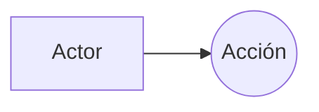

## Ejercicio 3: Diagrama de casos de uso

Una pequeña **academia online** quiere informatizar un sistema sencillo para gestionar la inscripción del alumnado en cursos.

En el sistema participan dos tipos de usuarios:

* **Alumno**: puede consultar los cursos disponibles y solicitar la inscripción en un curso.

* **Administrador**: se encarga de registrar las inscripciones y registrar la baja de un alumno en un curso.

El sistema debe permitir las siguientes acciones:

* Consultar cursos disponibles.

* Solicitar inscripción en un curso.

* Registrar inscripción.

* Registrar baja.

A partir de la descripción anterior:

1. Identifica los actores del sistema.

2. Identifica los casos de uso.

3. Dibuja en mermaid un diagrama de casos de uso UML que represente el sistema.

4. Añade las explicaciones y el diagrama creado en `docs/explicacion.md`.

5. Adjunta una captura del diagrama en `docs`.

6. Usa el siguiente formato para los diagramas:

